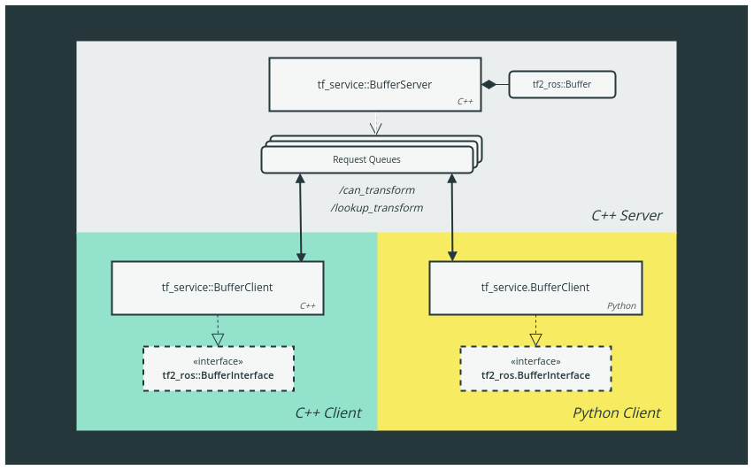

# tf_service

TF buffer server / client implementation based on ROS services.

Implemented in C++ and Python bindings.

| ROS noetic / melodic |
| :---: |
| [](https://travis-ci.org/magazino/tf_service) |

---



---

## Motivation

This package allows to outsource TF lookups for nodes with medium/low frequency requirements.
A central server node maintains a TF buffer and can handle requests from multiple clients.
This saves resources as the clients don't need to have their own TF listener.

### Shortcomings of the tf2_ros implementation

So far, that's nothing new - [`tf2_ros`](https://github.com/ros/geometry2) already comes with `tf2_ros::BufferClient`.
It uses ROS actions to communicate requests and response status between clients and server.

The idea is great, but it can scale badly with the number of clients and requests.
This is due to the broadcast nature of the [ROS action protocol](http://wiki.ros.org/actionlib/DetailedDescription#Action_Interface_.26_Transport_Layer), where each client receives status update callbacks of the currently active goals.
In the case of an TF server, this is not very practical because one client node doesn't care about the status of transform requests made by other nodes (especially if it would otherwise query at a low frequency).
Ultimately, this burns unnecessary CPU resources: see the "Benchmarks" section below for a synthetic example.

### tf_service implementation

In essence, `tf_service` simply uses persistent services instead of actions.

The server handles service requests from clients asynchronously (using a multi-threaded `ros::AsyncSpinner`) and answers directly to each requesting node, thus avoiding broadcasts to unaffected clients.

Especially for Python code this can improve performance a lot.

---
## server

```
rosrun tf_service server --num_threads 10
```

Starts the TF server node. The number of threads limits the number of request queues the server can handle in parallel.
Adapt this number to your requirements.

---
## client

The client implements the normal TF2 buffer interface.

### Python

The Python bindings are wrapped in a standard `tf2_ros.BufferInterface`:

```python
import rospy                                                         
import tf_service

# ...

buffer = tf_service.BufferClient("/tf_service")
buffer.wait_for_server()

# Use it like any other TF2 buffer.
if buffer.can_transform("map", "odom", rospy.Time(0), rospy.Duration(5)):
    buffer.lookup_transform("map", "odom", rospy.Time(0), rospy.Duration(1))
```

### C++

Implements a standard `tf2_ros::BufferInterface`:

```cpp
#include "ros/ros.h"
#include "tf_service/buffer_client.h"

// ...

tf_service::BufferClient buffer("/tf_service");
buffer.wait_for_server();

// Use it like any other TF2 buffer.
std::string errstr;
if (buffer.canTransform("map", "odom", ros::Time(0), ros::Duration(1), &errstr)) {
  buffer.lookupTransform("map", "odom", ros::Time(0), ros::Duration(1));
}
```

### Persistence

Service connections are [persistent](http://wiki.ros.org/roscpp/Overview/Services#Persistent_Connections) for performance reasons.
You can use the `wait_for_server` method with a timeout in case the connection was lost, it reestablishes a persistent connection if possible.

---
## Installation

### Package

*todo*

### From source

`git clone` the repo into your catkin workspace, install the dependencies and run:

```bash
catkin build tf_service
```

---
## Benchmarks

The Python client implementation is much more efficient than the old `tf2_ros.BufferClient`.

The test scenario are 5 clients doing requests at 10Hz. Compare the resource consumption of:
```
roslaunch tf_service benchmark_py.launch use_old_version:=true
```
with the new implementation from this package:
```
roslaunch tf_service benchmark_py.launch use_old_version:=false
```

## Limitations

Service calls are blocking and should be "short".
To reduce the risk that clients can brick the server, timeouts greater than 10 seconds are not allowed.

If you need very long timeouts, you might be better off with the old action-client based implementation from TF2.

## License

[Apache 2.0](https://www.apache.org/licenses/LICENSE-2.0)

Third-party notice:
Directly bundled / derived third party code is mentioned in the `NOTICE` file.
All other ROS / system dependencies are listed in the `package.xml` file.
